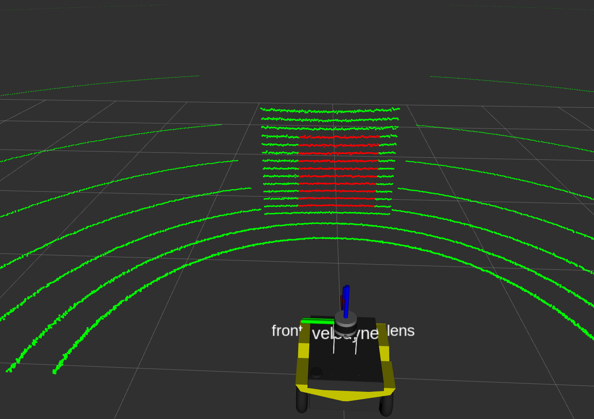
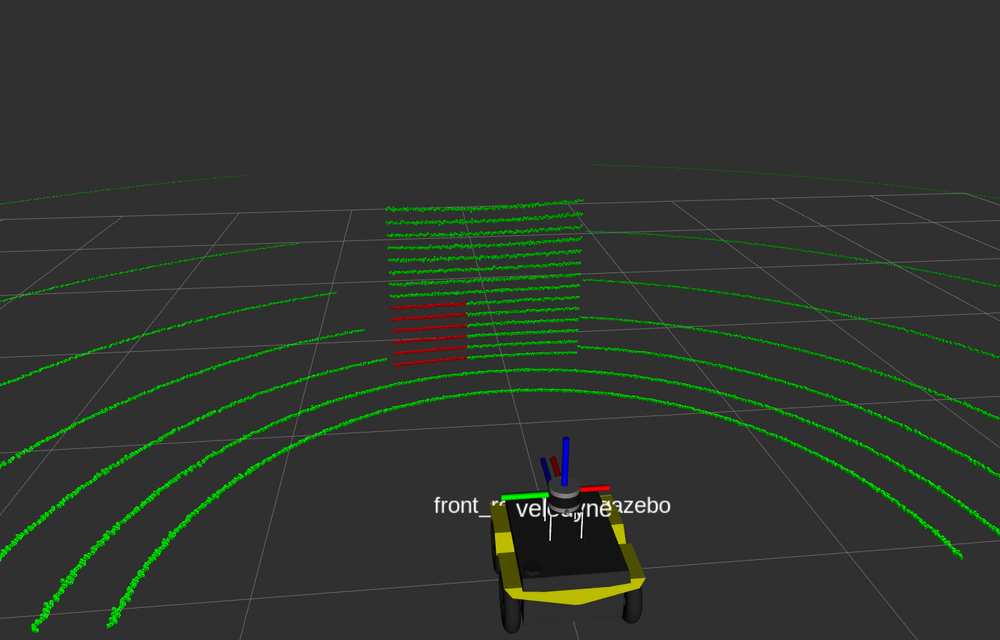

# Velo2rs Calibration ROS Package

This light-weighted ROS package is used to calibrate and find extrinsic parameters between lidar and an RGB-D camera. The package provides a straightforward approach to finding reference points from point clouds in Rviz for calibration calculation. The package is also compatible with any two sensors that measure` sensor_msgs::PointCloud2`. An explanation of the algorithm can be found in my [portfolio post](https://jiasenzheng.github.io/projects/0-slam-and-point-cloud-colourisation).

## Dependencies
* cv_bridge
* pcl library
* tf2_ros

## Calibration target

The calibration target can be rectangular prisms, such as an acrylic sheet, cardboard, or a package box.

## Usage 

You need to identify the topic published by the sensors to be calibrated. In particular, the package expects 3D point clouds (sensor_msgs::PointCloud2) from both your Lidar and RGB-D camera. The following launch file is run to find and save reference points.

**find_points.launch**
* find_rs_points: a node to find and collect reference points from the realsense camera
* find_velo_points: a node to find and collect reference points from the velodyne-16 Lidar
* /set_pos: a service to set a square-shape region on the target face to locate reference points
    - arg: horizontal_coord(double): the horizontal coordinate of the target region
    - arg: vertical_coord(double): the vertical coordinate of the target region
    - arg: dis(double): the distance from the assigned coordinates to the edge of the region
* /record_point: a service to find the corner coordinate of the target region. The coordinate will be displayed in the service call and then upload to a `calin_points.yaml` file
    - arg: position(string): the name of the desired corner position ('o':bottom-left; 'z':upper-left; 'x':bottom-right) 
    - return: point_x (double): the x coordinate of the desired point
    - return: point_y (double): the y coordinate of the desired point
    - return: point_z (double): the z coordinate of the desired point

Then, we need to load the recorded reference points and run the calibration algorithm in the following launch file.

**find_points.launch**
* calib_point.yaml: load the updated parameters of point coordinates
* calibration: a calibration node to compute the extrinsic between lidar and 

## Example

The example shows the process of calibration in a Gazebo simulation. 
1. We need to launch the Gazebo environment, robot description, and two find point nodes. In the terminal, run the following command:
```shell
roslaunch velo2rs find_points.launch
```
2. You will see the Jackal robot being spawned in Gazebo world with a square prism in front of it. The lidar point clouds are shown in Rviz with an initial red target region. The following picture shows the scene in Rviz.


3. Call the "/set_pos" service to move the target region to a position that aligns with the plane's edges. Note to add a namespace of "/velo" if testing the Velodyne and a namespace of "/rs" if testing the Realsense. 
The following image shows the scene of setting the region to the bottom-left corner of the target plane in Rviz.


4. Call the "/record_point" service with an argument of 'o' to return and update the bottom-left point of the region.

5. repeat step 3 and 4 to find and save points for positions 'z' and 'x' (upper-left and bottom-right).

6. repeat step 2,3,4,5 to find and save reference points for Realsense camera point clouds. Note to turn on the Realsense point cloud visualization in Rviz and change the namespace to "/rs".

7. Run the calibration launch file containing the updated reference points coordinates and the calibration node. In the terminal, run the following command:
```shell
roslaunch velo2rs calibration.launch
```
The extrinsic parameter will be printed out using ROS_INFO in the form of positions (XYZ in meters) and rotations (YPR in radians)


